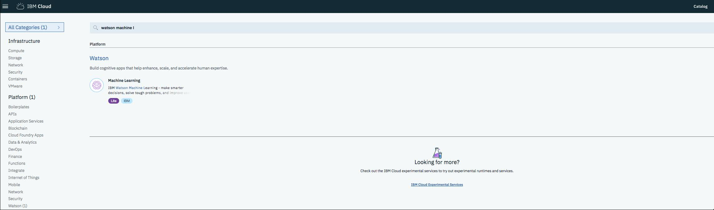
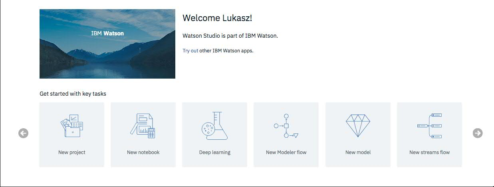
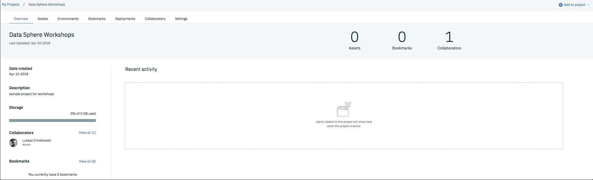

# DataSphere ML&DL Workshops
Watson Machine Learning Workshops

## Prerequisities:

### Signing up for a free trial

0. If you already have an IBM Cloud account, you can sign in to IBM Cloud at https://www.ibm.com/cloud/. Otherwise, follow step 1 to create IBM Cloud account.

1. Go to https://www.ibm.com/cloud and sign up for a free trial and register for IBM Cloud. When you're signing-up for a new account, please select **United States** as your country.

### Services provisioning
2. Go to [Catalog](https://console.bluemix.net/catalog/) and create Watson Studio service instance (**Lite** plan should be chosen)

**Tip**: Preferred region/location to deploy in: **US South**

## Creating a new project in IBM Watson Studio
3. Go to [Dashboard](https://console.bluemix.net/dashboard/apps) and open Watson Studio created instance and click `Get Started` button

4. Once signed in, click on the tile that says `New project`. Scroll to the bottom to find the tile for `Jupyter Notebooks`. Select it and press OK.

5. Define project name on the left panel and click `Create`. New Cloud Object Storage instance will be created automatically if there is no.

6. Great, you have covered the first milestone.

## Scenario 1: Product purchase prediction with Spark MLlib

**Description**: Within this scenario you will develop spark mllib model to predict product purchases. Next you will deploy this model as web service and bind sample web  application to it. The application will send scoring records to deployed model and display predicted purchases.

### Jupyter Notebook
1. In project `Settings tab` - `Associated services` section click `Add service` and create Spark and Machine Learning **Lite** service instances.

**Tip**: You can see all created services in [IBM Cloud Dashboard](https://console.bluemix.net/dashboard)

2. Go to `Assets` tab and create `(+) New notebook` from [file](https://dataplatform.ibm.com/analytics/notebooks/v2/d5e46fc8-3ea5-4982-a161-032905a2c42a/view?access_token=5cd484379907747b0e0e6a99d5546bcac8e39fb22268c7e0ff618db8c4e3c4bd).

  **Tip**: download sample notebook from URL using download button and use it as a notebook file. Select `Spark` service you added to project as a runtime environment for the notebook.

3. Execute notebook cells. Make sure that your Watson Machine Learning service credentials are put in cell [29].

  **Tip**: you can find your credentials on the Machine Learning service `credentials` tab [IBM Cloud Dashboard](https://console.bluemix.net/dashboard).

4. Great, you have covered the first part of scenario.

### Node.js application

Since our model is deployed as a web service it is a time to provide sample web application that will send scoring records to `scoring_endpoint` and in return present purchases predictions.

Deploy product line prediction [application](https://github.com/pmservice/product-line-prediction) to your Cloud account

1. Go to [Catalog](https://console.bluemix.net/catalog/) and create Continuous Delivery service.

2. Click `Start Here` and select `Develop a Cloud Foundry app`

3. On `Tool Integrations` section change **Source repository URL** to `https://github.com/pmservice/product-line-prediction`. (You can remove Eclipse Orion Web IDE)

4. Open [IBM Cloud Dashboard](https://console.bluemix.net/dashboard) and select deployed application in **Cloud Foundry Applications** . In `Connections` tab connect your app to Watson Machine Learning service.

5. `Restage` and you are all set - run the app by clicking `Visit App URL`.

## Scenario 2: 

### 2.1. Keras development using MNIST dataset

In this step, you will develop a deep learning model to classify hand-written digits using MNIST dataset. [Zip](https://github.com/pmservice/wml-sample-models/raw/master/keras/mnist/MNIST.zip)

### 2.2. Style transfer with Keras
**Description**: In this scenario you will learn how to run deep learning experiment to transfer style from famous painting (e.g. Picasso) to your photo.

### Jupyter Notebook
1. In project `Settings tab` - `Associated services` section click `Add service` and create Spark and Machine Learning **Lite** service instances.

  **Tip**: You can see all created services in [IBM Cloud Dashboard](https://console.bluemix.net/dashboard)

2. Go to `Assets` tab and create `(+) New notebook` from [file](https://dataplatform.ibm.com/analytics/notebooks/v2/b21d09ab-728f-4e70-a0cc-dcee9a395a9e/view?access_token=5f23e9fae56ca858df6795ec2d5b3bde9f5ff1224258f0f4703ea9327fd210b9).

  **Tip**: download sample notebook from URL using download button and use it as a notebook file. Select `Python/Anacaonda` as a runtime environment for the notebook.

3. Execute notebook cells. Make sure that your Watson Machine Learning service credentials are provided in notebook cell.

  **Tip**: you can find your credentials on the Machine Learning service `credentials` tab [IBM Cloud Dashboard](https://console.bluemix.net/dashboard).

4. Great, you have covered the first part of scenario.

### Python web application

0. Install the Cloud Foundry CLI using this [link](https://github.com/cloudfoundry/cli#downloads).

1. Follow up Style Transfer [deployment instruction](https://github.com/pmservice/style-transfer/blob/master/README.md) to clone and deploy python web app to your Cloud account.

2. You are all set - run the app by clicking `Visit App URL`.

3. Grab a style photo you like.

4. Take a photo of yourself and drag&drop both photos to web app.

5. Do the Style transfer.

**Note**: Deep Learning Experiment run time depends on number of iterations you select.
